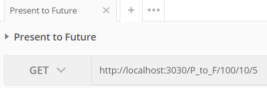

# TVMCalculator (WIP)
Ever had to take a course on Engineering Economics? I never knew it even existed until a semester at University introduced me to it. I found it troublesome to always be calculating the ratios by hand and created an api (To be completed Web and Android applications) to complete the calculations for you instead!

Introducing .... TVMCalculator!

## What it does
// TODO

## Tests
Automatable tests have been included under /tests and use Postman to automate testing for the api. Import the file into Postman and modify the parameters as required. Below I have listed the different possible calculations and what the parameters indicate. 

|                  Type                  | URL     |
|:--------------------------------------:|---------|
| Present to Future (F/P)                | P_to_F  |
| Future to Present (P/F)                | F_to_P  |
| Annuity to Future (F/A)                | A_to_F  |
| Future to Annuity (A/F)                | F_to_A  |
| Present to Annuity (A/P)               | P_to_A  |
| Annuity to Present (P/A)               | A_to_P  |
| Gradient to Annuity (A/G)              | G_to_A  |
| Gradient to Present (P/G)              | G_to_P  |
| Geometric Gradient to Present (P/G, g) | GA_to_P |
_Table 1: Table of URLS_

