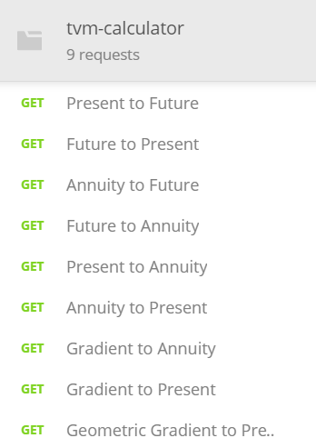

# TVMCalculator (WIP)
Ever had to take a course on Engineering Economics? I never knew it even existed until I took a mandatory course at UBC. I found it troublesome to always be calculating the ratios by hand and created an api (To be completed Web and Android applications) to complete the calculations for you instead!

Introducing .... TVMCalculator!

## What it does
// TODO

## Tests
Automatable tests have been included under /tests and use Postman to automate testing for the api. Import the file into Postman and modify the parameters as required. Below I have listed the different possible calculations and what the parameters indicate. 

_Figure 1: Comprehensive list of all possible calculations_

Listed above are all possible calculations, and refer to Table 1 and Figure 2 for a list and an example.

|                  Type                  | URL     |
|:--------------------------------------:|---------|
| Present to Future (F/P)                | P_to_F  |
| Future to Present (P/F)                | F_to_P  |
| Annuity to Future (F/A)                | A_to_F  |
| Future to Annuity (A/F)                | F_to_A  |
| Present to Annuity (A/P)               | P_to_A  |
| Annuity to Present (P/A)               | A_to_P  |
| Gradient to Annuity (A/G)              | G_to_A  |
| Gradient to Present (P/G)              | G_to_P  |
| Geometric Gradient to Present (P/G, g) | GA_to_P |

_Table 1: Table of URLs_

Table listed the possible URL attachments, but to actually access the API, you must make a call in the format of:

**Server URL + /Table URL + /Monetary Value + /Interest Rate (Percentage) + /Periods (Year) + /Geometric Growth (Optional**

_Figure 2: Example of Placing $100 in the bank at 10% interest for 5 years or 100(F/P, 10%, 5)_
